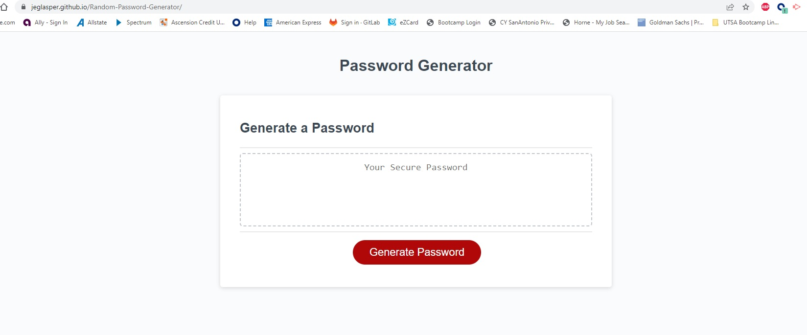

# Random-Password-Generator

## Description

### Project Motivation & Purpose

My motivation for creating this project was to create an easy tool for others to use to generate random passwords. Ultimately, I hope this project will simply the process of creating strong passwords while also helping me to learn in real time how to add interactivity to webpages via javascript. 

### What I Learned Doing This Project

I learned through this project how to use window prompts and alerts to gather information for variables. Those variables then can be used to create a new random product through the math function. This project was particularly helpful for me in learning how to use empty arrays and strings as well as how to use the math() functions to create random combinations. I would want to continue to push my own learning in this area by doing another javascript project. While I was able to complete this homework assignment with help, I would want to continue to build my understanding of javascript.

## Usage

This webpage can be used to generate random passwords from 8 to 128 characters that include at least one of the following: lowercase letters, uppercase letters, numbers, and/or special characters. Please see below for links to Github Repository, the deployed website, and a screenshot of the deployed website:

Deployed Website: https://jeglasper.github.io/Random-Password-Generator/

Git Hub Repository: https://github.com/jeglasper/Random-Password-Generator

## Credits

Jamie Rachael. https://github.com/jamierachael/Password-Generator

"JS CheatSheet" https://htmlcheatsheet.com/js/

MG-cpu90. https://github.com/MG-cpu90/passwordgenerator

Paul Keldsen - Web Development (YouTube). "Homework Startup Guide - JavaScript Password Generator". https://www.youtube.com/watch?v=x4HUaiazDes

Tiffany Casey. https://github.com/TiffanyCasey/Password-Generator

Traversy Media (YouTube). "JavaScript Crash Course for Beginners". https://www.youtube.com/watch?v=hdI2bqOjy3c

W3 School. "JavaScript Array concat()".https://www.w3schools.com/jsref/jsref_concat_array.asp

## License

Please refer to the LICENSE in the repo.